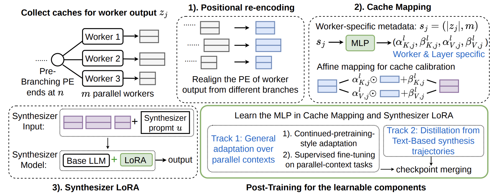

# Parallel Synthesis

Implementation for the paper [Towards Direct Latent-Space Synthesis for Parallel Branches
in LLM-Agent Workflows](https://arxiv.org/abs/2606.14672) by Shikun Liu, Mufei Li, Dongqi Fu, Haoyu Wang, Yinglong Xia, Hong Li, Hong Yan, Pan Li.

## Overview

Parallel agent workflows naturally branch: workers independently solve
subproblems, retrieve evidence, or use tools before a synthesizer combines
their results. Standard synthesis flattens those branches into one text prompt
and makes the model prefill their outputs again. Parallel Synthesis instead
lets the synthesizer directly consume the workers' KV caches, preserving the
branch structure while avoiding redundant prefill.

<p align="center"></p>

The framework combines positional re-encoding, a lightweight cache mapper, and
a synthesizer LoRA. In the paper, it matches or outperforms text-based synthesis
on seven of nine downstream datasets, remains close on the other two, and
reduces time-to-first-token by 2.5×–11×. This repository provides the training
and evaluation code for the Qwen3-14B experiments.

## Supported evaluations

| Family | Datasets | Command |
| --- | --- | --- |
| Single-turn QA, math, and code | GSM8K, AIME 2024/2025, GPQA, MedQA, HumanEval+, MBPP+ | `parallel-synthesis-single` |
| Multi-turn tool use | GAIA Levels 1–3 | `parallel-synthesis-gaia` |
| Multi-agent database diagnosis | MARBLE DB | `parallel-synthesis-marble` |

All three main commands execute the worker agents and synthesizer end to end.
GAIA also provides `parallel-synthesis-gaia-sanity`, which reruns synthesis
over worker trajectories saved by an earlier GAIA run. This is useful when web
search would be costly or variable.

## Installation

Python 3.10 and a CUDA-capable PyTorch installation are recommended.

```bash
git clone https://github.com/Graph-COM/Parallel-Synthesis.git
cd Parallel-Synthesis

conda create -n parallel-synthesis python=3.10 -y
conda activate parallel-synthesis
pip install -e .
```

If the PyTorch version selected by `pip` does not match your CUDA setup,
install the appropriate PyTorch wheel first. GAIA attachment parsing and
MARBLE DB require the additional tool dependencies:

```bash
pip install -r requirements-tools.txt
```

Copy `.env.example` to `.env` if you want to configure optional GAIA web
services or Hugging Face authentication. `flash-attn`, vLLM, and
bitsandbytes are optional; the Parallel Synthesis route works with Transformers
and SDPA.

## Checkpoint

The trained cache mapper and synthesizer LoRA are published at
[`Graph-COM/Parallel-Synthesis-qwen3-14B`](https://huggingface.co/Graph-COM/Parallel-Synthesis-qwen3-14B).
Set the checkpoint source to that Hub repository:

```bash
export CHECKPOINT_DIR=Graph-COM/Parallel-Synthesis-qwen3-14B
```

The evaluation commands accept either a Hugging Face repository ID or a local
directory. On first use, a repository ID is downloaded to the standard Hugging
Face cache and reused by later runs. To download it explicitly instead:

```bash
hf download Graph-COM/Parallel-Synthesis-qwen3-14B \
  --local-dir checkpoints/parallel-synthesis-qwen3-14b
export CHECKPOINT_DIR=checkpoints/parallel-synthesis-qwen3-14b
```

This is a Parallel Synthesis component checkpoint, not a standalone
Transformers model. Keep `--model_name Qwen/Qwen3-14B`: the frozen backbone is
downloaded separately, while `--checkpoint_dir` or `--parallel_kv_load_dir`
loads `cache_mapper.pt` and `judger_lora/`. Passing the checkpoint repository
as `--model_name` will not work.

## Quick start

Single-turn evaluation:

```bash
parallel-synthesis-single \
  --checkpoint_dir "$CHECKPOINT_DIR" \
  --method parallel_kv \
  --model_name Qwen/Qwen3-14B \
  --tasks aime2024,gpqa,humanevalplus \
  --split test \
  --eval_samples_per_task 10 \
  --temperature 0 \
  --top_p 1 \
  --output_dir results/single_turn
```

GAIA:

```bash
parallel-synthesis-gaia \
  --method parallel_kv \
  --model_name Qwen/Qwen3-14B \
  --parallel_kv_load_dir "$CHECKPOINT_DIR" \
  --gaia_config 2023_level1 \
  --split validation \
  --max_samples 10 \
  --max_tool_steps 5 \
  --output_dir results/gaia
```

MARBLE DB:

```bash
parallel-synthesis-marble \
  --method parallel_kv \
  --model_name Qwen/Qwen3-14B \
  --parallel_kv_load_dir "$CHECKPOINT_DIR" \
  --db_backend marble_docker \
  --max_samples 10 \
  --output_dir results/marble_db
```

The paper reports GAIA validation results separately for Levels 1, 2, and 3.
Run the command once per level with `--gaia_config 2023_level1`,
`2023_level2`, or `2023_level3`, using a different output directory for
each. All reported results use the validation split; GAIA test answers require
official submission, and GAIA has no train evaluation split. GAIA uses the
prompt reported in the paper appendix; MARBLE DB uses its own appendix prompt.
Prompt variants are not exposed by the runners.
GAIA questions with attached files are supported through the `parse_file`
tool. After Hugging Face authentication, the runner downloads them
automatically and reuses the local Hugging Face cache on later runs. No dataset
paths or source-code changes are required.

Ready-to-edit launch scripts are under `recipes/evaluation/`. See
[docs/EVALUATION.md](docs/EVALUATION.md) for complete dataset, sharding,
fixed-trajectory, and text-baseline instructions.

## Outputs and HTML reports

GAIA, GAIA sanity, and MARBLE DB stream results to:

```text
<output_dir>/
  run_args.json
  preds.jsonl
  summary.json
```

Single-turn evaluation writes `run_args.json`, `post_eval_summary.json`,
and one `post_eval_<split>_<task>_preds.jsonl` file per task. Prediction rows
retain agent inputs, outputs, timing, scores, and tool interactions where
applicable. Sharded runs write each shard under
`shards/shard<I>of<N>/`; merge commands are documented in
[docs/EVALUATION.md](docs/EVALUATION.md#sharding).

Render saved GAIA or MARBLE DB results as standalone HTML:

```bash
python -m parallel_synthesis.toolcall.analyze_logs \
  --run_dir results/gaia \
  --include_prompts

python -m parallel_synthesis.marble_db.analyze_logs \
  --run_dir results/marble_db \
  --include_prompts
```

The commands write `toolcall_analysis.html` and
`marble_db_analysis.html` in their respective run directories.

## Text-synthesis baseline

The included baseline concatenates the parallel workers' text responses before
synthesis. It uses the base model directly and has no separate LoRA:

```bash
parallel-synthesis-text-baseline \
  --method text_mas \
  --task aime2024 \
  --model_name Qwen/Qwen3-14B \
  --max_samples 10 \
  --log_dir results/text_mas
```

For GAIA and MARBLE DB, pass `--method text_mas` to their main commands.
External comparison implementations are available from the
[CacheBlend/LMCache](https://github.com/LMCache/LMCache) and
[KVLink](https://github.com/UCSB-NLP-Chang/KVLink) repositories.

## Training

The trainer optimizes the cache mapper and synthesizer LoRA while keeping the
Qwen3 backbone frozen. The release checkpoint was trained in three stages:

```text
recipes/training/01_train_general.sh
recipes/training/02_train_browsecomp.sh
recipes/training/03_merge_release_checkpoint.sh
```

The repository includes the 1,211-row format-filtered BrowseComp trajectory
dataset as a compressed JSONL file. The stage-two recipe reads it directly;
no download or manual decompression is needed. This filtered dataset is a
runnable training artifact, but it was not the 1,266-row dataset used by the
published checkpoint.

See [docs/DATA.md](docs/DATA.md) to prepare the training corpora and
[docs/TRAINING.md](docs/TRAINING.md) for the checkpoint lineage and exact
commands. Dataset revisions, row counts, and checksums are recorded in
[artifacts/training_data.json](artifacts/training_data.json).

## Repository layout

```text
parallel_synthesis/  Installable training and evaluation package
data/                Training-data preparation scripts
recipes/             Evaluation and training launch scripts
artifacts/           Checkpoint and dataset manifests
docs/                Data, evaluation, and training guides
```

## Citation

```bibtex
@article{liu2026towards,
  title={Towards Direct Latent-Space Synthesis for Parallel Branches in LLM-Agent Workflows},
  author={Liu, Shikun and Li, Mufei and Fu, Dongqi and Wang, Haoyu and Xia, Yinglong and Li, Hong and Yan, Hong and Li, Pan},
  journal={arXiv preprint arXiv:2606.14672},
  year={2026}
}
```
